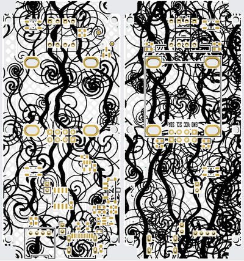

# PCB Camouflage (KiCad Plugin)

流線型のゼブラ柄や有機的なスワール（渦巻き）による**カモフラージュパターンを基板シルク層へ自動生成**するKiCadプラグインです。
基板デザインのアクセントや、配線パターンの視覚的カムフラージュに役立ちます。

**部品パッドの自動回避（クリアランス確保）**や**既存シルク記号（ピン1印や極性マーク等）の自動保護**、**リファレンス番号の安全な退避・ワンクリック復元**など、実際の基板製造（DRC）と実用性を考慮した機能を備えています。

---

## 主な機能

### 1. カモフラージュ生成 & 重ね掛け（マルチレイヤー）
* **Test Mule Swirl**: 有機的な渦巻き・スワール曲線パターン
* **Zebra Waves**: 流線型のウネウネ波状ストライプ
* **範囲ランダム入力**: パターンスケール、線幅、波の角度（真横基準の傾き）をそれぞれ `[ Min ] - [ Max ]` で指定でき、線1本ごとに自然にランダム変化
* **重ね掛け（マルチレイヤー）**: 異なるパターンを上から重ねて自然に一体化

### 2. パッド & 既存シルク自動回避（DRC・はんだ付け安全設計）
* 対象面のSMDパッドおよびスルーホールパッドを自動検出し、クリアランス分をくり抜き（はんだ付け面へのシルク乗りを完全に防止）。
* フットプリントのピン1印（▶）やダイオード極性バーなどの重要なシルク記号も自動検知・保護し、DRCのシルク重なりエラーを防止。

### 3. リファレンス番号の非表示 & シルク退避（Silk Stash & Restore）
* カモフラージュと干渉する部品番号（R1, C1等）をワンクリックで非表示化。
* 基板直描きのシルクを未使用のユーザーレイヤー（`User.9 → User.8 …` の降順で自動探索）へ安全に一時退避・完全復元。

### 4. 設定の自動保存
* 入力したパラメータ（スケール、線幅、角度など）はプロジェクトごとの設定ファイル（`.{project}.pcb_camo.json`）に自動保存され、次回起動時にも復元。

### 5. ワンクリック削除・再生成
* 生成した迷彩パターンのみを検出し、一括削除・再生成が可能。

---

## 使い方

1. Pcbnew（基板エディタ）の上部ツールバーまたは「ツール」メニューから **PCB Camouflage** アイコンをクリックして起動します。
2. **Step 1: Stash Silkscreen**:
   * 部品リファレンス（R1, C1等）を非表示化し、必要に応じてシルクを退避します。
3. **Step 2: Generate & Layer Camouflage Pattern**:
   * 対象レイヤー（F.Silkscreen / B.Silkscreen）およびパターン種別（Swirl / Zebra Waves）を選択します。
   * スケール、線幅、波の角度などの範囲（Min - Max）やパッドクリアランスを設定します。
   * **[ 2. Add Camo Layer (重ね掛け) ]** をクリックして生成します（複数回押して重ね掛け可能）。
4. **Step 3 / Step 4**:
   * 迷彩のみ消したい場合は **[ 3. Clear Camo Only ]**、元のシルク表示に戻したい場合は **[ 4. Restore Silkscreen ]** をクリックします。

---

## インストール方法

### プラグイン＆コンテンツマネージャー (PCM) からのインストール
1. 本リポジトリの [Releases](../../releases) ページから、最新の **`kicad-plugin.zip`** をダウンロードします。
2. KiCad を起動し、メイン画面の **プラグイン＆コンテンツマネージャー**（Plugin and Content Manager）を開きます。
3. 画面右下の **「ファイルからインストール...」**（Install from File...）をクリックします。
4. ダウンロードした `kicad-plugin.zip` を選択します。
5. KiCad を再起動すると、Pcbnewのツールバーおよびメニューにアイコンが追加されます。

---

## ライセンス

MIT License
